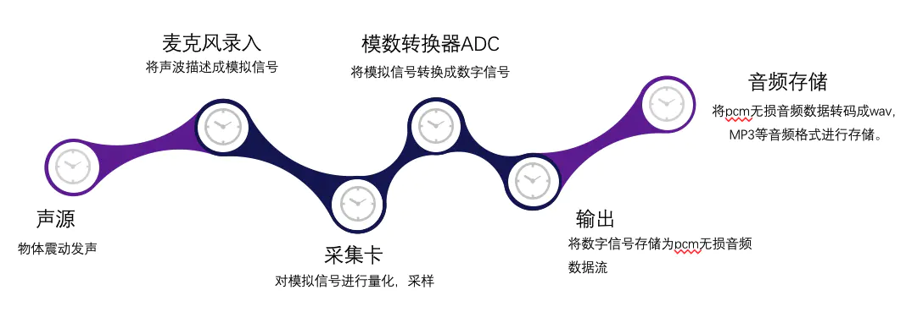

<!--
 * @Author: mcdowell
 * @Date: 2020-06-19 11:45:03
 * @LastEditors: mcdowell
 * @LastEditTime: 2020-07-02 19:41:32
-->

# 音视频 基础知识

首先 做 webrtc 网页即时通信 开发，其实就是开始了音视频开发。必须知道和理解视频相关术语和参数，及其相关的原理和作用。

所以，我们从头说。

## 音频

### 声音的物理特征

> 声音是由物体振动而产生的

#### 声波的三要素

声波的三要素是频率(代表音阶的高低)、振幅(代表响度)和波形(代表音色)。

人类耳朵的听力有一个频率范围，大约是 20Hz~20kHz，不过，即 使是在这个频率范围内，不同的频率，听力的感觉也会不一样。

- 人耳对 3~4kHz 频率范围内的声音比较敏感， 而对于较低或较高频率的声音，敏感度就会有所减弱;
- 在声压级较低 时，听觉的频率特性会很不均匀;
- 而在声压级较高时，听觉的频率特性 会变得较为均匀。
- 频率范围较宽的音乐，其声压以 80~90dB 为最佳，超 过 90dB 将会损害人耳(105dB 为人耳极限)

#### 声音的传播介质

声音的传播介质 需要介质，它可以通过空气、液体和固体进行传播;而且介质不同，传播的 速度也不同，比如，声音在空气中的传播速度为 340m/s，在蒸馏水中的 传播速度为 1497m/s，而在铁棒中的传播速度则可以高达 5200m/s;不 过，声音在真空中是无法传播的。

#### 回声

当我们在高山或空旷地带高声大喊的时候，经常会听到回声 (echo)。之所以会有回声是因为声音在传播过程中遇到障碍物会反弹 回来。

但是，若两种声音传到我们的耳朵里的时差小于 80 毫秒，我们就无 法区分开这两种声音了，其实在日常生活中，人耳也在收集回声，只不 过由于嘈杂的外界环境以及回声的分贝(衡量声音能量值大小的单位) 比较低，所以我们的耳朵分辨不出这样的声音，或者说是大脑能接收到 但分辨不出。

#### 共鸣

两个频率相同的物体，敲击其中一个物体时另一个物体 也会振动发声，这种现象称为共鸣，共鸣证明了声音传播可以带动另一个物体振 动，也就是说，声音的传播过程也是一种能量的传播过程

++++++++++++++++++++++++++++++++++++++++++++++++++++++++++++++

### 数字音频

> **麦克风是如何采集声音的**
> 麦克风里面有一层碳膜，非常薄而且十分敏感。 声音其实是一种纵波，会压缩空气也会压缩这层碳膜，碳膜在受到挤压 时也会发出振动，在碳膜的下方就是一个电极，碳膜在振动的时候会接 触电极，接触时间的长短和频率与声波的振动幅度和频率有关，这样就 完成了声音信号到电信号的转换。之后再经过放大电路处理，就可以实施后面的采样量化处理了。

为了将模拟信号数字化 分别要对模拟信号进行 采样、量化和编码。

#### 采样

**采样**就是 在时间轴上对信号进行数字化。

- 根据奈奎斯特定理(也称为采样定 理)，按比声音最高频率高 2 倍以上的频率对声音进行采样(也称为 AD 转换)，
- 对于高质量的音频信号，其频率范围(人耳 能够听到的频率范围)是 20Hz~20kHz，所以采样频率一般为 44.1kHz，这样就可以保证采样声音达到 20kHz 也能被数字化，从而使得 经过数字化处理之后，人耳听到的声音质量不会被降低。
- 而所谓的 44.1kHz 就是代表 1 秒会采样 44100 次。

#### 量化

**量化**是指在幅度轴上对信号进行数字化，比如用 16 比特（16 个二进制位） 的二进制信号来表示声音的一个采样，而 16 比特(一个 short)所表示的 范围是[-32768，32767]，共有 65536 个可能取值，因此最终模拟的音频 信号在幅度上也分为了 65536 层

#### 编码

所谓编码，就是按照一定的格式记录采样和量化后的数字数据，比如顺序存储或压缩存储，等等。

#### PCM

> **PCM(Pulse Code Modulation，脉冲编码调制)** 音频数据是**未经压缩的音频采样数据裸流**，它是由模拟信号经过采样、量化、编码转换成的标准数字音频数据。

通常所说的音频的裸数据格式就是**脉冲 编码调制(Pulse Code Modulation，PCM)数据**。描述一段 PCM 数据一 般需要以下几个概念:**量化格式(sampleFormat)、采样率 (sampleRate)、声道数(channel)**。

以 CD 的音质为例:

- 量化格式为 16-bit(2 字节)，采样率(Sample Rate)为 44100，声道数为 2，这些信息就描述了 CD 的音质。
- 而对于声音格式，还有一个概念用来 描述它的大小，称为**数据比特率**(即 1 秒时间内的比特数目，用于衡 量音频数据单位时间内的容量大小)
- 对于 CD 音质的数据，**比特率**为：`44100 * 16 * 2 = 1378.125kbps`
- 1 分钟里，这类 CD 音质的数据需要占据多大的存储需要 `1378.125 * 60 / 8（8位是1字节得到KB） / 1024(KB换算MB) = 10.09MB`

如果 **量化格式(sampleFormat) 更加精确**【比如用 4 字节(32-bit)来描述一个采样】，或者 **采样率（sampleRate**） 更加密集(比如 48kHz 的采样率)，那么所占的 **存储空间就会更大**，同时能够**描述的声音细节就会越精确**。

存储的**这段二进制数据**即表示**将模拟信号转换为数字信号**了，以后就可以对这段二进制数据进行存储、播放、复制，或者进行其他任何操作。

> PCM 是软件层接收到最原始的音频格式数据。[浏览器支持 audio api 直接播放 PCM](https://segmentfault.com/a/1190000017982073)

#### 分贝

分贝是用来表示**声音强度的单位**。日常生活中听到的声音，若以声压值来表示，由于其变化范围非 常大，可以达到六个数量级以上，同时由于我们的耳朵对声音信号强弱 刺激的反应不是线性的，而是呈对数比例 关系，所以引入分贝的概念来表达声学量值。所谓分贝是指两个相同的 物理量(例如，A1 和 A0)之比取以 10 为底的对数并乘以 10(或 20)， 即:

### 音频编码

上文中，提到了 CD 音质的数据采样格式，曾计算出每分钟需要的存 储空间约为 10.1MB，如果仅仅是将其存放在存储设备(光盘、硬盘) 中，可能是可以接受的，但是若要在网络中实时在线传播的话，那么这 个数据量可能就太大了，所以必须对其进行**压缩编码**。

#### 压缩编码

- 压缩编码的基本指标之一就是**压缩比**，压缩比通常小于 1(否则就没有必要去做压缩， 因为压缩就是要减小数据容量)

- 压缩算法:
  - 无损压缩：无损压缩是指解压后的数据可以完全复原。
  - 有损压缩：指解压后的数据不能完全复原，会丢失一部分信息；
    - 用得较多；
    - 压缩比越小，丢失的信息就越多，信号还原后的失真就会 越大；
    - 根据不同的应用场景(包括存储设备、传输网络环境、播放设备 等)，可以选用不同的压缩编码算法，如 PCM、WAV、AAC、MP3、 Ogg 等

> 压缩编码的原理实际上是**压缩掉冗余信号**，冗余信号是指不能被人 耳感知到的信号，包含人耳听觉范围之外的音频信号以及被掩蔽掉的音频信号等。而被掩蔽掉的音频信号则主要是因为人耳的掩蔽效应， 主要表现为频域掩蔽效应与时域掩蔽效应，无论是在时域还是频域上， 被掩蔽掉的声音信号都被认为是冗余信息，不进行编码处理。

#### 几种常用的压缩编码格式

##### WAV 编码

- WAV 编码的一种实现(有多种实现方式，但是都不会进行压缩操作)就是在 PCM 数据格式的前面加上 44 字 节
  - 用来描述 PCM 的采样率、声道数、数据格式等信息
  - 特点: **音质非常好，大量软件都支持**
  - 适用场合: 多媒体开发的中间文件、保存音乐和音效素材

##### MP3 编码

- MP3 具有不错的压缩比
- 使用 LAME 编码(MP3 编码格式的一种实 现)的中高码率的 MP3 文件，听感上非常接近源 WAV 文件(在不同的应用场景下，应该调整合适的参数以达到最好的效果)
- 特点: 音质在 **128Kbit/s 以上**表现还不错，**压缩比比较高**，大量软件和硬件都支持，**兼容性好**。
- 适用场合: **高比特率**下**对兼容性有要求**的音乐欣赏。

##### AAC 编码

- AAC 是新一代的音频有损压缩技术，
- LC-AAC、HE-AAC、HE-AAC v2 三种 主要的编码格式。
  - LC-AAC 是比较传统的 AAC，相对而言，其主要应用 于**中高码率场景的编码**(≥80Kbit/s);
  - HE-AAC (相当于 AAC+SBR) 主要应用于**中低码率场景的编码**(≤80Kbit/s);
  - HE-AAC v2 (相当于 AAC+SBR+PS)主要应用于**低码率场景的编码** (≤48Kbit/s)。
  - 事实上大部分编码器都设置为 ≤48Kbit/s 自动启用 PS 技 术，而>48Kbit/s 则不加 PS，相当于普通的 HE-AAC。
- 特点: 在**小于 128Kbit/s** 的码率下表现**优异**，并且多**用于视频中的音频编码**。
- 适用场合: **128Kbit/s 以下的音频编码**，多用于视频中音频轨的编码。

##### Ogg 编码

- Ogg 是一种非常有潜力的编码，
- 在各种码率下都有比较优秀的表现，尤其是在中低码率场景下。
- **音质好**、**完全免费**、**出色的算法**（更小的码率达到更好的音质）
  - 128Kbit/s 的 Ogg 比 192Kbit/s 甚至更 高码率的 MP3 还要出色
- **兼容性差**：受支持的情况还不够好，无 论是软件上的还是硬件上的支持，都无法和 MP3 相提并论。
- 特点: 可以用**比 MP3 小的码率**实现**比 MP3 更好的音质**，**高中低码率下均有良好的表现**，**流媒体特性不支持**。
- 适用场合:语音聊天的音频消息场景。

----

## 图像

### 图像的物理现象

> 视频是由一幅幅图像组成的，所以要学习视频还得从图像说起

**光的本质**：红绿蓝三种色光无法被分解，故称为三原色光，等量的三原色光相加会变为白光，即白光中含有等量的红光（R）、绿光（G）、蓝光（B），不同等量的三色光，组成不同的颜色。

在日常生活中，由于光的反射，我们才能看到各类物体的轮廓及颜色。你看到红色物体是因为 反射的红光，吸收了其他颜色的光，所以你看到的是红色；你看到蓝色物体是因为 反射的蓝光，吸收了其他颜色的光，所以你看到的是蓝色。

当然，并不都是反射光的。还有自发光的，如太阳、电灯还有我们要说的 显示屏。

### 显示屏的显示

假设一部手机屏幕的分辨率是1280×720，说明水平方向有720个**像素**点，垂直方向有1280个**像素**点，所以整个手机屏幕就有1280×720个**像素**点（这也是**分辨率的含义**）。

每个**像素**点都由**三个子像素（红R绿G蓝B）**点组成。【通俗点说它的颜色混合方式就好像有红、绿、蓝三盏灯，当它们的光相互叠合的时候，色彩相混，而亮度却等于三者亮度之总和，越混合亮度越高，即加法混合】

[液晶屏幕的显示原理](https://blog.csdn.net/npuliyanhua/article/details/105482221)

### 图像的数值表示

#### RGB表示方式

- **浮点表示**：取值范围为0.0～1.0，比如，在OpenGL ES中对每一个子像素点的表示使用的就是这种表达方式。
- **整数表示**：取值范围为**0～255**或者**00～FF**，8个比特表示一个子像素，32个比特（除了RGB三色外，还有 alpha 透明度;也就是 4*8）表示一个像素，这就是类似于某些平台上表示图像格式的RGBA_8888数据格式。

对于一幅图像，一般使用整数表示方法来进行描述，
比如计算一张1280×720的RGBA_8888图像的大小，可采用如下方式：`1280 * 720 * 4 = 3.516MB`
这也是位图（bitmap）在内存中所占用的大小，所以每一张图像的裸数据都是很大的。

对于图像的裸数据来讲，直接在网络上进行传输也是不太可能的，所以就有了**图像的压缩格式**，
比如JPEG压缩：**JPEG是静态图像压缩标准，由ISO制定**。

> JPEG图像压缩算法在提供良好的压缩性能的同时，具有较好的重建质量。
> 这种算法被广泛应用于图像处理领域，当然其也是一种有损压缩。
> 在很多网站如淘宝上使用的都是这种压缩之后的图片，但是，这种压缩不能直接应用于视频压缩，因为对于视频来讲，还有一个时域上的因素需要考虑，也就是说，不仅仅要考虑帧内编码，还要考虑帧间编码。视频采用的是更成熟的算法。

#### YUV表示方式

[推荐-Digital video concepts](https://developer.mozilla.org/en-US/docs/Web/Media/Formats/Video_concepts)

YUV 也是一种色彩编码方法，主要用于电视系统以及模拟视频领域。它将亮度信息（Y）与色彩信息（UV）分离，即使没有 UV 信息一样可以显示完整的图像，只不过是黑白的，这样的设计很好地解决了彩色电视机与黑白电视的兼容问题。

与RGB视频信号传输相比，它最大的优点在于只需要占用极少的频宽（RGB要求三个独立的视频信号同时传输）。其中“Y”表示明亮度（Luminance或Luma），也称灰阶值；而“U”和“V”表示的则是色度（Chrominance或Chroma），它们的作用是描述影像的色彩及饱和度，用于指定像素的颜色。

“亮度”是透过RGB输入信号来建立的，方法是将RGB信号的特定部分叠加到一起。“色度”则定义了颜色的两个方面——色调与饱和度，分别用Cr和Cb来表示。其中，Cr反映了RGB输入信号红色部分与RGB信号亮度值之间的差异，而Cb反映的则是RGB输入信号蓝色部分与RGB信号亮度值之间的差异。

### 视频编码

音频压缩主要是去除冗余信息，从而实现数据量的压缩。其实视频压缩也是通过去除冗余信息来进行压缩的。

相较于音频数据，视频数据有极强的相关性，也就是说有大量的冗余信息，包括空间上的冗余信息和时间上的冗余信息。使用帧间编码技术可以去除时间上的冗余信息，具体包括以下几个部分。

- **运动补偿**：运动补偿是通过先前的局部图像来预测、补偿当前的局部图像，它是减少帧序列冗余信息的有效方法。
- **运动表示**：不同区域的图像需要使用不同的运动矢量来描述运动信息。
- **运动估计**：运动估计是从视频序列中抽取运动信息的一整套技术。使用帧内编码技术可以去除空间上的冗余信息。

- ISO视频压缩标准（Motion JPEG 即MPEG）：
  - Mpeg1（用于VCD）
  - Mpeg2（用于DVD）
  - Mpeg4 AVC（现在流媒体使用最多的就是它了）
- ITU-视频压缩标准
- H.261
- H.262
- H.263
- H.264 （集中了以往标准的所有优点，并吸取了以往标准的经验）

> 现在使用最多的就是H.264标准，H.264创造了多参考帧、多块类型、整数变换、帧内预测等新的压缩技术，使用了更精细的分像素运动矢量（1/4、1/8）和新一代的环路滤波器，这使得压缩性能得到大大提高，系统也变得更加完善

### 编码概念

#### IPB帧

视频压缩中，每帧都代表着一幅静止的图像。而在进行实际压缩时，会采**取各种算法以减少数据的容量，其中IPB帧就是最常见的一种**。

- I 帧：**关键帧**。压缩率低，可以单独解码成一幅完整的图像。
- P 帧：**参考帧**。压缩率较高，解码时依赖于前面已解码的数据。
  - P帧需要参考其前面的一个I帧或者P帧来解码成一张完整的视频画面。
- B 帧：**前后参考帧**。压缩率最高，解码时不光依赖前面已经解码的帧，而且还依赖它后面的 P 帧。换句话说就是，B 帧后面的 P 帧要优先于它进行解码，然后才能将 B 帧解码。
  - B帧则需要参考其前一个**I帧或者P帧**及其后面的一个**P帧**来生成一张完整的视频画面，所以**P帧与B帧去掉的是视频帧在时间维度上的冗余信息**

##### H.264 的 IDR帧与I帧的理解

IDR帧（instantaneous decoding refreshpicture）
IDR帧与I帧的区别

IDR帧就是一种特殊的I帧，即这一帧之后的所有参考帧只会参考到这个IDR帧，而不会再参考前面的帧。在解码器中，一旦收到一个IDR帧，就会立即清理参考帧缓冲区，并将IDR帧作为被参考的帧。

>因为H.264采用了**多帧预测**，所以 I帧 之后的 P帧有**可能会参考I帧之前的帧**，这就使得在随机访问的时候**不能以找到I帧作**为参考条件，因为即使找到I帧，I帧之后的帧还是**有可能解析不出来**

## 数字视频

[视音频编解码技术零基础学习方法](https://blog.csdn.net/leixiaohua1020/article/details/18893769)
