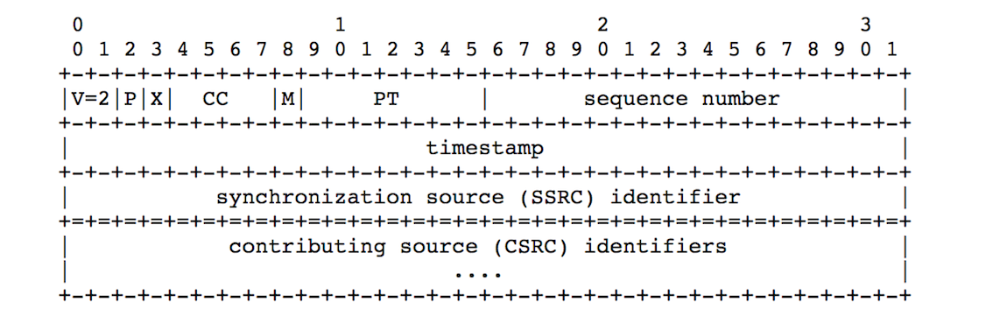
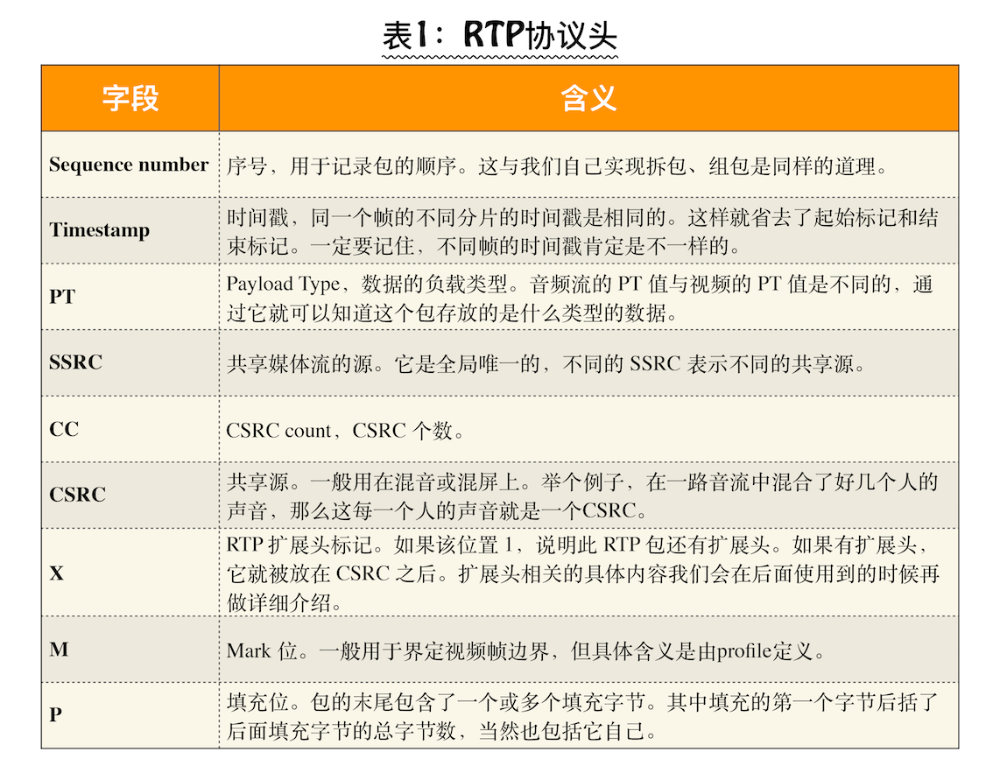
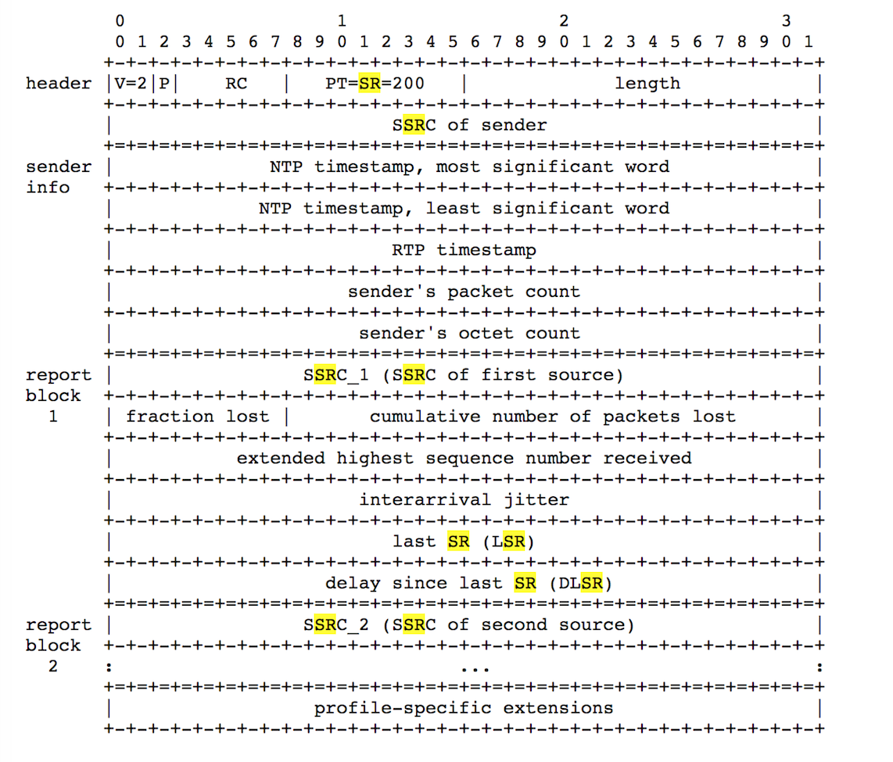
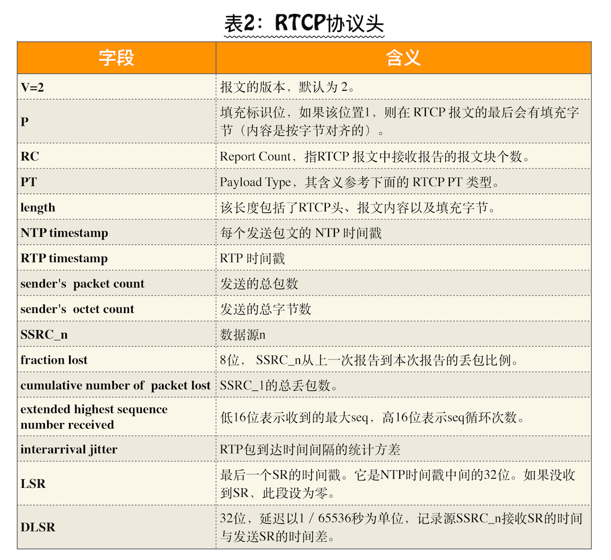
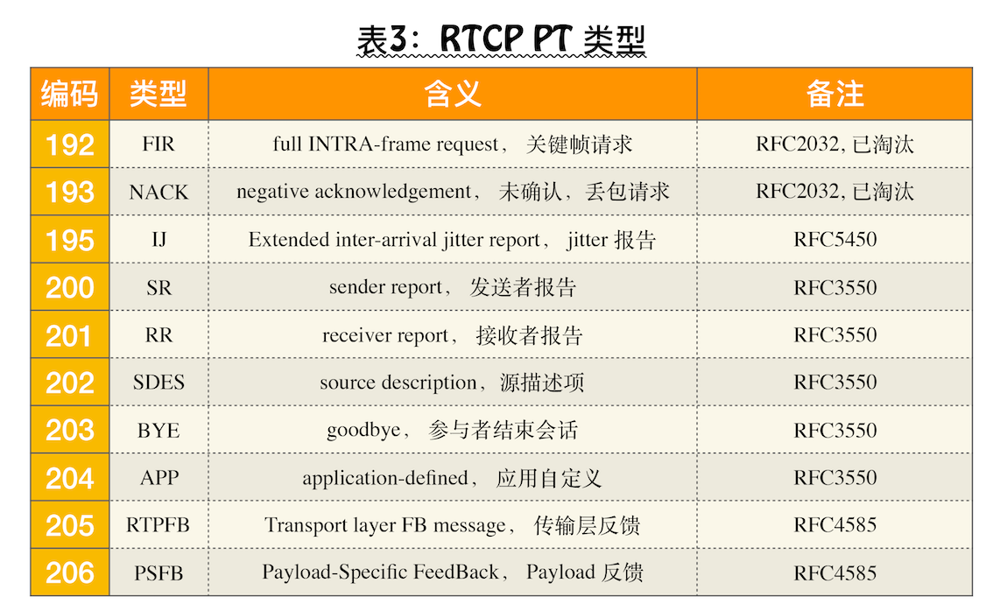

<!--
 * @Author: mcdowell
 * @Date: 2020-05-26 19:34:22
 * @LastEditors: mcdowell
 * @LastEditTime: 2020-05-27 16:53:16
-->

# RTP 及 RTCP 详解

## 实时互动直播系统，是 TCP 还是 UDP

**实时互动直播系统的时候你必须使用 UDP 协议。**

1. UDP 传输快，但不可靠，尤其是在用户的网络质量很差的情况下，基本无法保障音视频的服务质量
2. TCP 比较可靠，为了可靠基本就是，“发送 -> 确认；超时 -> 重发”的反复过程，在这断线重发的过程，最长可达到（失败 7 次）2 分 07 秒， 对于实时直播来说，相当致命。

> 在 TCP 协议中，为了避免重传次数过多，定时器的超时时间会按 2 的指数增长。也就是说，假设第一次设置的超时时间是 1 秒，那么第二次就是 2 秒，第三次是 4 秒……第七次是 64 秒。如果第七次之后仍然超时，则断开 TCP 连接。你可以计算一下，从第一次超时，到最后断开连接，这之间一共经历了 2 分 07 秒

## RTP/RTCP

> 一般情况下，在实时互动直播系统传输音视频数据流时，我们并不直接将音视频数据流交给 UDP 传输，而是**先给音视频数据加个 RTP 头，然后再交给 UDP 进行传输**

以视频帧为例，一个 I 帧的数据量是非常大的，最少也要几十 K.而以太网的最大传输单元是 1.5K，所以要传输一个 I 帧需要几十个包。并且这几十个包传到对端后，还要重新组装成 I 帧，这样才能进行解码还原出一幅幅的图像。

所以要想传输，至少需要以下几个标识。

- **序号**：用于标识传输包的序号，这样就可以知道这个包是第几个分片了。
- **起始标记**：记录分帧的第一个 UDP 包。
- **结束标记**：记录分帧的最后一个 UDP 包。

  有了上面这几个标识字段，我们就可以在发送端进行拆包，在接收端将视频帧重新再组装起来了。

### RTP 协议 (Real-time Transport Protocol 实时传输协议)

> 针对上面的设计，人们专门定义了一套规范，它就是 RTP 协议。
> 用于传输流媒体数据

- **sequence number**：序号，用于记录包的顺序。与上面的序号标记作用相同。
- **timestamp**：时间戳，同一个帧的不同分片的时间戳是相同的。这样就省去了前面所讲的起始标记和结束标记。**不同帧的时间戳肯定是不一样的**。
- **PT**：Payload Type，数据的负载类型。音频流的 PT 值与视频的 PT 值是不同的，简单来说就是**标记音频视频的**。
- ...

如果需要自己去解码解，需要对每个字段含义了如指掌。

### RTCP (对 RTP 进行控制，同步)

在使用 RTP 包传输数据时，难免会发生丢包、乱序、抖动等问题：

- 网络线路质量问题引起丢包率高；
- 传输的数据超过了带宽的负载引起的丢包问题；
- 信号干扰（信号弱）引起的丢包问题；
- 跨运营商引入的丢包问题 ;
- ...

WebRTC 对这些问题在底层都有相应的处理策略（网络不好如降低码率等操作），但在处理这些问题之前，它首先要让各端都知道它们自己的网络质量到底是怎样的，这就是 RTCP 的作用,用于**对 RTP 进行控制，同步**

RTCP 通过：**SR**(Sender Report)【发送方】和 **RR**（Reciever Report）【回执方】 报文的交换，各端 了解 当前 **网络质量**。

#### SR(Sender Report)

以 RTCP SR 报文为例：

header 分析：

- V=2，指报文的版本。
- P，表示填充位，如果该位置 1，则在 RTCP 报文的最后会有填充字节（内容是按字节对齐的）。
- RC，全称 Report Count，指 RTCP 报文中接收报告的报文块个数。
- PT=200，Payload Type，也就是说 SR 的值为 200。
- ... 具体如下

从上图中我们可以了解到，SR 报文分成三部分

- **Header** 部分用于标识该**报文的类型**，比如是 SR 还是 RR。
- **Sender info** 部分用于指明**作为发送方**，到底**发了多少包**。
- **Report block** 部分指明发送方**作为接收方时**，它**从各个 SSRC 接收包的情况**。
  > SR 报文并不仅是指发送方发了多少数据，它还报告了作为接收方，它接收到的数据的情况。当发送端收到对端的接收报告时，它就可以根据接收报告来评估它与对端之间的网络质量了，随后再根据网络质量做传输策略的调整

#### FIR (Full Intra Request) 【完整帧请求】

在一个房间里有 3 个人进行音视频聊天，当第四个人加入到房间后，它首先**发送 FIR 报文**，当其他端**收到该报文后**，便立即产生**各自的 IDR 帧发送给新加入的人**，这样当新加入的人拿到房间中其他的 IDR 帧(俗称 I 帧)后，它的解码器就会解码成功，于是其他人的画面也就一下子全部展示出来了。

## 

> RTCP 控制协议需要与 RTP 数据协议一起配合使用，当应用程序启动一个 RTP 会话时将同时占用两个端口，分别供 RTP 和 RTCP 使用。
> **RTP** 本身并**不能为按序传输数据包提供可靠的保证**，也**不提供流量控制和拥塞控制**，这些都由 **RTCP 来负责完成**。
> 通常 RTCP 会采用与 RTP 相同的分发机制，向会话中的所有成员周期性地发送控制信息，应用程序通过接收这些数据，**从中获取会话参与者的相关资料，以及网络状况、分组丢失概率等反馈信息，从而能够对服务质量进行控制或者对网络状况进行诊断**。

[RTP/RTSP/RTCP 有什么区别？](https://www.zhihu.com/question/20278635/answer/14590945)
