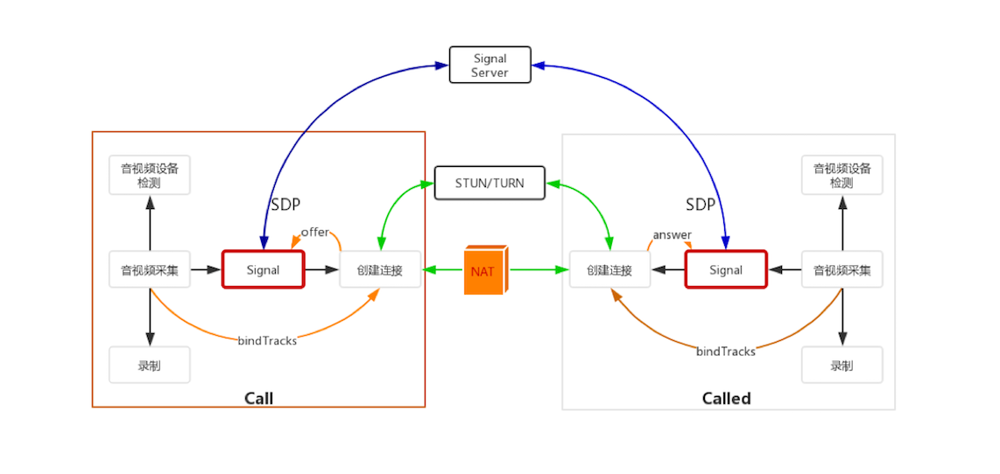

<!--
 * @Author: mcdowell
 * @Date: 2020-05-27 16:53:32
 * @LastEditors: mcdowell
 * @LastEditTime: 2020-05-28 16:59:20
-->

# WebRTC 的驱动核心:SDP

## SDP 是什么

SDP（Session Description Protocal）[会话描述协议]

> 说直白点就是用**文本描述的各端（PC 端、Mac 端、Android 端、iOS 端等）的能力**。这里的能力指的是**各端所支持的音频编解码器**是什么，这些**编解码器设定的参数**是什么，使用的**传输协议**是什么，以及包括的**音视频媒体是什么**等等。

SDP 片段

```xml
 v=0
 o=- 3409821183230872764 2 IN IP4 127.0.0.1
 ...
 m=audio 9 UDP/TLS/RTP/SAVPF 111 103 104 9 0 8 106 105 13 110 112 113 126
 ...
 a=rtpmap:111 opus/48000/2
 a=rtpmap:103 ISAC/16000
 a=rtpmap:104 ISAC/32000
 ...
```

解析说明：

- SDP 中描述了一路音频流，即 m=audio，该音频支持的 Payload ( 即数据负载 ) 类型包括 111、103、104 等等
- a=rtpmap:111 opus/48000/2 表示 Payload 类型为 111 的数据是 OPUS 编码的音频数据，并且它的采样率是 48000，使用双声道。
- a=rtpmap:104 ISAC/32000 的含义是音频数据使用 ISAC 编码，采样频率是 32000，使用单声道
- ...

## 交换 SDP 信息



两个客户端 / 浏览器进行 1 对 1 通话时，首先要**进行信令交互**，而交互的**一个重要信息就是 SDP 的交换**

> 交换 SDP 的目的是 **彼此清楚知道双方能力**，**然后根据双方各自的能力进行协商**，**协商出**大家认可的**音视频编解码器**、**编解码器相关的参数（如音频通道数，采样率等）**、**传输协议等信息**。

例如：A 与 B 进行通讯

1. 先**各自在 SDP 中记录自己支持的音频参数、视频参数、传输协议等信息**，
2. 然后再**将自己的 SDP 信息通过信令服务器发送给对方**。
3. 当一方收到对端传来的 SDP 信息后，它会**将接收到的 SDP 与自己的 SDP 进行比较**，并**取出它们之间的交集**，这个交集就是它们**协商的结果**，也就是它们**最终使用的音视频参数及传输协议**了

## 标准 SDP 规范

[标准文档说明](https://tools.ietf.org/html/rfc4566#page-24)

标准 SDP 规范 主要包括**SDP 描述格式**和**SDP 结构**

- SDP 描述格式
- SDP 结构 （从每段信息描述）
  - 会话描述 （一个）
  - 媒体信息描述 （多个）
    - 媒体类型
    - 媒体格式
    - 传输协议
    - 传输的 IP 和端口

> 媒体信息描述是整个 SDP 规范中最重要的知识

### SDP 的格式 【每个区间段代表的意思】

SDP 是由多个 <type>=<value> 这样的表达式组成的。其中，<type>是一个字符，<value>是一个字符串。需要特别注意的是，“=” 两边是不能有空格的。

SDP 由**一个会话级描述**（session level description）和**多个媒体级描述**（media level description）组成

- 会话级（session level）: **对整个会话作用**，其位置是**从 v= 行**开始到**第一个媒体描述为止**。
- 媒体级（media level）: **对单个的媒体流进行描述**，其位置是**从 m= 行**开始到下一个媒体描述（即**下一个 m=**）为止

SDP 示例：

```xml
# 会话描述
v=0
o=- 7017624586836067756 2 IN IP4 127.0.0.1
s=-
t=0 0

# 下面 m= 开头的两行，是两个媒体流：一个音频，一个视频。
m=audio 9 UDP/TLS/RTP/SAVPF 111 103 104 9 0 8 106 105 13 126
...
m=video 9 UDP/TLS/RTP/SAVPF 96 97 98 99 100 101 102 122 127 121 125 107 108 109 124 120 123 119 114 115 116
...
```

### SDP 的结构 【各个区间的 字段代表的含义】

#### 会话描述

> 介绍 比较重要的 四个字段

- **`v=（protocol version，必选）`**；【v version 必选】
  - 例子：v=0 ，表示 SDP 的版本号，但不包括次版本号
- **`o=（owner/creator and session identifier，必选)`**【o origin/owner 必选 】
  - 例子：**`o=<username> <session id> <version> <network type> <address type> <address>`**，该例子是对一个会话发起者的描述
    - 其中，o= 表示的是对会话发起者的描述；
      `<username>`：用户名，当不关心用户名时，可以用 “－” 代替 ；
      `<session id>` ：数字串，在整个会话中，必须是唯一的，建议使用 NTP 时间戳；
      `<version>`：版本号，每次会话数据修改后，该版本值会递增；
      `<network type>` ：网络类型，一般为“IN”，表示“internet”；
      `<address type>`：地址类型，一般为 IP4；
      `<address>`：IP 地址。
- **s= sessionName 必选 -为忽略**
  - 例子：**`s=<session name>`**，该例子表示一个会话，在整个 SDP 中有且只有一个会话，也就是只有一个 s=。
- **`t=（time the session is active，必选)`**。
  - 例子：**`t=<start time> <stop time>`**，该例子描述了会话的开始时间和结束时间。
    - `<start time>` 和 `<stop time>` 为 NTP 时间，单位是秒；
    - 当`<start time>`和`<stop time>`均为零时，表示持久会话。

#### 媒体描述

> 介绍 比较重要的 四个字段

- **c connectionData 必选** 数据连接
  - `c=<network type> <address type> <connection address>`
  - eg: `c=IN IP4 0.0.0.0` : internet ipv4 ip 地址
- **`m=（media name and transport address，可选）`**。
  - 例子：**`m=<media> <port> <transport> <fmt list>`**，
    - 表示一个会话。在一个 SDP 中一般会有多个媒体描述。
    - 每个媒体描述以“m=”开始到下一个“m=”结束。其中，
    - `<media>`：媒体类型，比如 audio/video 等；
    - `<port>`：端口；
    - `<transport>`：传输协议，有两种——RTP/AVP 和 UDP；
    - `<fmt list>`：媒体格式，即数据负载类型 (Payload Type) 列表。
- **`a=\*（zero or more media attribute lines，可选）`**。
  - 例子：`a=<TYPE>`或 `a=<TYPE>:<VALUES>`，
    - 表示属性，用于进一步描述媒体信息；
    - 在例子中， 指属性的类型。eg: `a=framerate:<帧速率>`
    - a= 有两个特别的属性类型，即下面要介绍的 rtpmap 和 fmtp。
- **rtpmap（可选）**。
  - 例子：`a=rtpmap:<payload type> <encoding name>/<clock rate>[/<encodingparameters>]`。
    - rtpmap 是 rtp 与 map 的结合，即 RTP 参数映射表。
    - `<payload type>` ：负载类型，对应 RTP 包中的音视频数据负载类型。
    - `<encoding name>`：编码器名称，如 VP8、VP9、OPUS 等。
    - `<sample rate>`：采样率，如音频的采样率频率 32000、48000 等。
    - `<encodingparameters>`：编码参数，如音频是否是双声道，默认为单声道
    - eg: `a=rtpmap:103 ISAC/160000` 103 对应 ISAC 始终频率 16000 次每秒
- **fmtp**。
  - 例子：`a=fmtp:<payload type> <format specific parameters>`。
    - fmtp，格式参数，即 format parameters；
    - `<payload type>` ，负载类型，同样对应 RTP 包中的音视频数据负载类型；
    - `< format specific parameters>`指具体参数
    - eg: `a=fmtp:103 apt=106 103关联106属性`

### 一个示例对照表

```xml
v=0
o=- 4007659306182774937 2 IN IP4 127.0.0.1 #
s=-
t=0 0
// 以上表示会话描述
...
// 下面的媒体描述，在媒体描述部分包括音频和视频两路媒体
m=audio 9 UDP/TLS/RTP/SAVPF 111 103 104 9 0 8 106 105 13 110 112 113 126
...
a=rtpmap:111 opus/48000/2 // 对 RTP 数据的描述
a=fmtp:111 minptime=10;useinbandfec=1 // 对格式参数的描述
...
a=rtpmap:103 ISAC/16000
a=rtpmap:104 ISAC/32000
...
// 上面是音频媒体描述，下面是视频媒体描述
m=video 9 UDP/TLS/RTP/SAVPF 96 97 98 99 100 101 102 122 127 121 125 107 108 109 124 120 123 119 114 115 116
...
a=rtpmap:96 VP8/90000
```

## WebRTC 中的 SDP

[文档 - draft-nandakumar-rtcweb-sdp](https://www.ietf.org/archive/id/draft-nandakumar-rtcweb-sdp-08.txt)

WebRTC 对标准 SDP 规范做了一些调整：

### WebRTC 中的 SDP 结构分层

- SDP
  - 会话层 Session Metadata，会话元数据 -- 就是 SDP 标准规范中的会话层描述
  - 媒体层
    - 媒体流描述 Stream Description -- 与 SDP 标准规范中的媒体层描述是一致的
    - 网络描述 Network Description -- 与 SDP 标准规范中的媒体层描述是一致的
    - 安全描述 Security Descriptions -- WebRTC 新增的属性描述
    - 服务质量描述 Qos Grouping Descriptions -- WebRTC 新增的属性描述

摘自 文档 结构示意图：

```txt
                                                 +---------------------+
                                                 |        v=           |
                                                 +---------------------+
                 +---------------------+         +---------------------+
         ====    |   Session Metadata  |  =====  |        o=           |
         |       +---------------------+         +----------------------
         |                                       +---------------------+
         |                                       |        t=           |
         |                                       +---------------------+
         |
         |
         |                                       +---------------------+
         |                                       |        c=           |
         |                                       +---------------------+
         |       +---------------------+
         ====    | Network Description |   =====
         |       +---------------------+
         |                                       +---------------------+
         |                                       |    a=candidate      |
         |                                       +---------------------+
         |
         |
         |                                       +---------------------+
         |                                       |        m=           |
         |                                       +---------------------+
         |        +---------------------+        +---------------------+
         ====     | Stream Description  |  ===== |      a=rtpmap       |
         |        +---------------------+        +----------------------
         |                                       +---------------------+
         |                                       |      a=fmtp         |
         |                                       +---------------------+
         |                                       +---------------------+
         |                                       |      a=sendrecv..   |
         |                                       +---------------------+
 +---------------+
 |    SEMANTIC   |
 | COMPONENTS OF |
 |     SDP       |
 +---------------+
         |                                       +---------------------+
         |                                       |      a=crypto       |
         |                                       +---------------------+
         |         +---------------------+       +---------------------+
         ====      |Security Descriptions|  =====|      a=ice-frag     |
         |         +---------------------+       +---------------------+
         |                                       +---------------------+
         |                                       |      a=ice-pwd      |
         |                                       +---------------------+
         |                                       +---------------------+
         |                                       |     a=fingerprint   |
         |                                       +---------------------+
         |
         |
         |
         |                                       +---------------------+
         |                                       |      a=rtcp-fb      |
         |                                       +---------------------+
         |         +---------------------+       +---------------------+
         ====      |   Qos,Grouping      |       |                     |
                   |   Descriptions      |  =====|       a=group       |
                   +---------------------+       +----------------------
                                                 +---------------------+
                                                 |       a=rtcpmux     |
                                                 +---------------------+
```

```xml
...
//======= 安全描述 ============
a=ice-ufrag:1uEe // 进入连通性检测的用户名
a=ice-pwd:RQe+y7SOLQJET+duNJ+Qbk7z// 密码，这两个是用于连通性检测的凭证
a=fingerprint:sha-256 35:6F:40:3D:F6:9B:BA:5B:F6:2A:7F:65:59:60:6D:6B:F9:C7:AE:46:44:B4:E4:73:F8:60:67:4D:58:E2:EB:9C //DTLS 指纹认证，以识别是否是合法用户
...
//======== 服务质量描述 =========
a=rtcp-mux
a=rtcp-rsize
a=rtpmap:96 VP8/90000
a=rtcp-fb:96 goog-remb // 使用 google 的带宽评估算法
a=rtcp-fb:96 transport-cc // 启动防拥塞
a=rtcp-fb:96 ccm fir // 解码出错，请求关键帧
a=rtcp-fb:96 nack    // 启用丢包重传功能
a=rtcp-fb:96 nack pli // 与 fir 类似
...
```

上面的 SDP 片段是摘取的 **WebRTC SDP 中的安全描述与服务质量描述**，这两块描述在标准 SDP 规范中没有明确定义，它更多属于 WebRTC 业务的范畴。

### 安全描述起的作用

- 一方面是**进行网络连通性检测时**，**对用户身份进行认证**；
- 另一方面是**收发数据时**，**对用户身份的认证**，以免受到对方的攻击。

### 服务质量描述

> 指明**启动功能以保证音视频的质量**

- 如启动带宽评估，当用户发送数据量太大超过评估的带宽时，要及时减少数据包的发送；
- 启动防拥塞功能，当预测到要发生拥塞时，通过降低流量的方式防止拥塞的发生等等，这些都属于服务质量描述的范畴。

完整的示例：

```xml
//============= 会话描述 ====================
v=0
o=- 7017624586836067756 2 IN IP4 127.0.0.1
s=-
t=0 0
...

//================ 媒体描述 =================
//================ 音频媒体 =================
/*
 * 音频使用端口 1024 收发数据
 * UDP/TLS/RTP/SAVPF 表示使用 dtls/srtp 协议对数据加密传输
 * 111、103 ... 表示本会话音频数据的 Payload Type
 */
 m=audio 1024 UDP/TLS/RTP/SAVPF 111 103 104 9 0 8 106 105 13 126

//============== 网络描述 ==================
// 指明接收或者发送音频使用的 IP 地址，由于 WebRTC 使用 ICE 传输，这个被忽略。
c=IN IP4 0.0.0.0
// 用来设置 rtcp 地址和端口，WebRTC 不使用
a=rtcp:9 IN IP4 0.0.0.0
...

//============== 音频安全描述 ================
//ICE 协商过程中的安全验证信息
a=ice-ufrag:khLS
a=ice-pwd:cxLzteJaJBou3DspNaPsJhlQ
a=fingerprint:sha-256 FA:14:42:3B:C7:97:1B:E8:AE:0C2:71:03:05:05:16:8F:B9:C7:98:E9:60:43:4B:5B:2C:28:EE:5C:8F3:17
...

//============== 音频流媒体描述 ================
a=rtpmap:111 opus/48000/2
//minptime 代表最小打包时长是 10ms，useinbandfec=1 代表使用 opus 编码内置 fec 特性
a=fmtp:111 minptime=10;useinbandfec=1
...
a=rtpmap:103 ISAC/16000
a=rtpmap:104 ISAC/32000
a=rtpmap:9 G722/8000
...

//================= 视频媒体 =================
m=video 9 UDP/TLS/RTP/SAVPF 100 101 107 116 117 96 97 99 98
...
//================= 网络描述 =================
c=IN IP4 0.0.0.0
a=rtcp:9 IN IP4 0.0.0.0
...
//================= 视频安全描述 =================
a=ice-ufrag:khLS
a=ice-pwd:cxLzteJaJBou3DspNaPsJhlQ
a=fingerprint:sha-256 FA:14:42:3B:C7:97:1B:E8:AE:0C2:71:03:05:05:16:8F:B9:C7:98:E9:60:43:4B:5B:2C:28:EE:5C:8F3:17
...

//================ 视频流描述 ===============
a=mid:video
...
a=rtpmap:100 VP8/90000
//================ 服务质量描述 ===============
a=rtcp-fb:100 ccm fir
a=rtcp-fb:100 nack // 支持丢包重传，参考 rfc4585
a=rtcp-fb:100 nack pli
a=rtcp-fb:100 goog-remb // 支持使用 rtcp 包来控制发送方的码流
a=rtcp-fb:100 transport-cc
...
```
