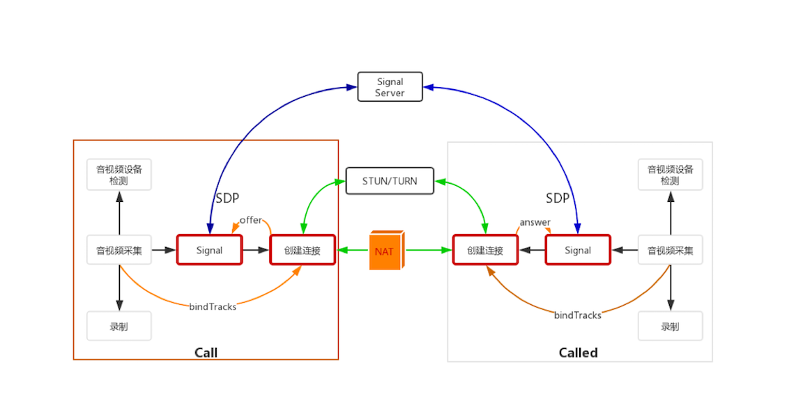

<!--
 * @Author: mcdowell
 * @Date: 2020-05-28 17:37:21
 * @LastEditors: mcdowell
 * @LastEditTime: 2020-06-15 23:37:12
-->

# 媒体协商

> 媒体协商 就是 双方客户端 设备都支持那些编解码器，双方都支持的设备，作为协议编解码的参数



媒体协商包括两部分：

- **创建连接**，指的是**创建 RTCPeerConnection**，它负责端与端之间彼此建立 P2P 连接。
- **信令**signal，指的是客户端通过信令服务器交换 SDP 信息。

## 媒体协商作用

媒体协商的作用就是**让双方找到共同支持的媒体能力**(如双方都支持的编解码器)，从而**最终实现彼此之间的音视频通信**。

## 媒体协商过程

1. 通信双方将它们各自的媒体信息，如编解码器、媒体流的 SSRC(RTCP 的控制报文)、传输协议、IP 地址和端口等，按 SDP 格式整理好。
2. 通信双方通过信令服务器交换 SDP 信息，并待彼此拿到对方的 SDP 信息后，找出它们共同支持的媒体能力。
3. 双方按照协商好的媒体能力开始音视频通信

## RTCPeerConnection

> **端与端之间建立连接**,WebRTC 库中最关键的一个类，通过它创建出来的对象可以做很多事情，如 NAT 穿越、音视频数据的接收与发送，甚至它还可以用于非音视频数据的传输等等
> RTCPeerConnection 除了会在端与端之间建立连接、传输音视频数据外，还要**进行两次绑定**：一次是与媒体源进行绑定，以解决数据从哪里来的问题；另外一次是与输出进行绑定，以解决接收到的音视频数据显示 / 播放的问题。

```js
var pcConfig = null
var RTCPeerConnection =
  window.RTCPeerConnection || window.webkitRTCPeerConnection
var pc = new RTCPeerConnection(pcConfig)
```

## 媒体协商的过程

### Offer 与 Answer

- Offer，在双方通讯时，呼叫方（clientA）发送的 SDP 消息称为 Offer。
- Answer，在双方通讯时，被呼叫方（clientB）发送的 SDP 消息称为 Answer。


### 协商的过程

- 呼叫方 **创建 Offer** 类型的 SDP 消息。
- 创建完成后，**调用 setLocalDescriptoin 方法将该 Offer 保存到本地 Local 域**，然后**通过==信令==将 Offer 发送给被呼叫方**。
- 被呼叫方**收到 Offer** 类型的 SDP 消息后，**调用 setRemoteDescription 方法将 Offer 保存到它的 Remote 域**。
- 作为应答，被呼叫方**要创建 Answer 类型的 SDP 消息，Answer 消息创建成功后，再调用 setLocalDescription 方法将 Answer 类型的 SDP 消息保存到本地的 Local 域**。
- 最后，被呼叫方将 **Answer 消息通过信令发送给**呼叫方。至此，被呼叫方的工作就完部完成了。

- 接下来是呼叫方的收尾工作，呼叫方收到 Answer 类型的消息后，调用 RTCPeerConnecton 对象的 setRemoteDescription 方法，将 Answer 保存到它的 Remote 域。

> 当通讯双方拿到彼此的 SDP 信息后，就可以进行媒体协商了。媒体协商的具体过程是在 WebRTC 内部实现的，我们作为 webrtc 使用者，需要 **本地的 SDP 和远端的 SDP 都设置好**后，协商就算成功了。

- createOffer ，创建 Offer；
- createAnswer，创建 Answer；
- setLocalDescription，设置本地 SDP 信息；
- setRemoteDescription，设置远端的 SDP 信息。

> 通信双方链路的建立是在设置本地媒体能力，即调用 setLocalDescription 函数之后才进行的。

详细代码过程：

1. 呼叫方**创建 Offer**

   - 创建 Offer 类型的 SDP 信息，即**调用 RTCPeerConnection 的 createOffer()** 方法
   - 成功后，调用 **RTCPeerConnection 的 setLocalDescription()** 把本地 SDP（会话描述）信息，提交到本地域
   - 通过信令通道将此会话描述发送给被呼叫方

   > createOffer、setLocalDescription 返回 一个 Promise

   ```js
   function doCall() {
     console.log('Sending offer to peer')
     // pc.createOffer(setLocalAndSendMessage, handleCreateOfferError)
     pc.createOffer(
       function (sessionDescription) {
         // sessionDescription -- RTCSessionDescription 类型的 SDP 信息
         console.log(sessionDescription, 'sessionDescription--成功')
         // 将本地 SDP 描述信息设置到 WebRTC 的 Local 域
         pc.setLocalDescription(sessionDescription)
         sendMessage(sessionDescription)
       },
       function (error) {
         console.log(error, '---报错')
       }
     )
   }
   ```

   ```js
   // 推荐使用方式
   function doCall() {
     pc.createOffer()
       .then(function (offer) {
         console.log(offer, 'offer')
         pc_offer = pc.setLocalDescription(offer)
         return pc_offer
       })
       .then(function () {
         console.log('通过信令服务来发送', pc_offer)
         // Send the offer to the remote peer using the signaling server
       })
       .catch((reportError) => {
         console.log(reportError, 'reportError--报错')
       })
   }
   ```

2. 被呼叫方收到 Offer

   - **调用 setRemoteDescription** 方法设置呼叫方发送给它的 Offer 作为远端描述。

   ```js
     socket.on('message', function(message) {
         ...
         } else if (message.type === 'offer') {
             // 设置 呼叫方的 offer 到远端域
             // 借助 RTCSessionDescription 进行解析
             pc.setRemoteDescription(new RTCSessionDescription(message));
             // 一般在此处 进行 第三步，createAnswer 创建被呼叫放的应答
             doAnswer();
         } else if (...) {
             ...
         }
         ....
     });
   ```

3. 被呼叫方**创建 Answer**

   - 被呼叫方**调用 RTCPeerConnection 对象的 createAnswer 方法**，它会生成一个与远程会话兼容的本地会话，并最终将该会话描述发送给呼叫方。

   > createAnswer、setLocalDescription 返回 一个 Promise

```js
pc.createAnswer()
  .then(function (answer) {
    return pc.setLocalDescription(answer)
  })
  .then(function () {
    // Send the answer to the remote peer through the signaling server.
  })
  .catch(handleGetUserMediaError)
```

4. 呼叫方收到 Answer
   - 当呼叫方得到 被呼叫方的 会话描述(SDP) 时，**调用 setRemoteDescription 方法，将收到的会话描述设置为一个远程会话**。代码如下：

```js
    socket.on('message', function(message) {
      ...
      } else if (message.type === 'answer') {

          pc.setRemoteDescription(new RTCSessionDescription(message));
      } else if (...) {
          ...
      }
      ....
  });
```

5. 媒体协商过程完成。
6. 紧接着**在 WebRTC 底层会收集 ==Candidate==，并进行连通性检测**，最终在通话双方之间建立起一条链路来。
