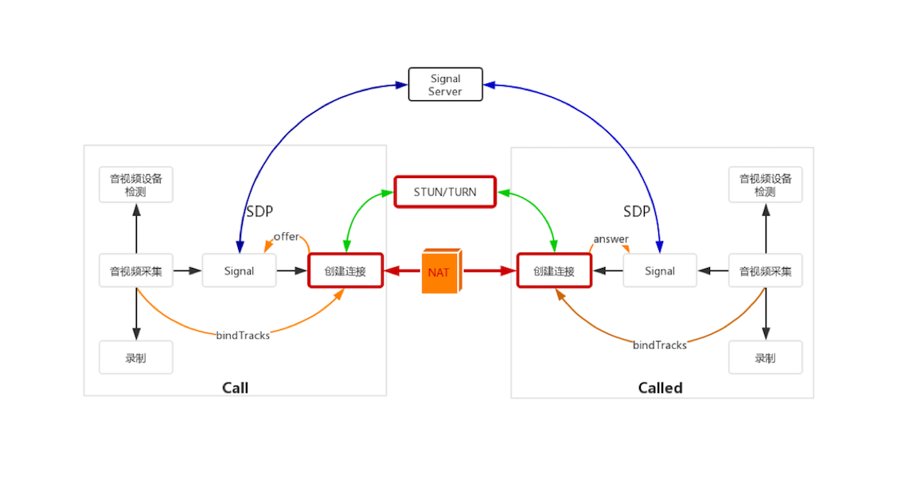
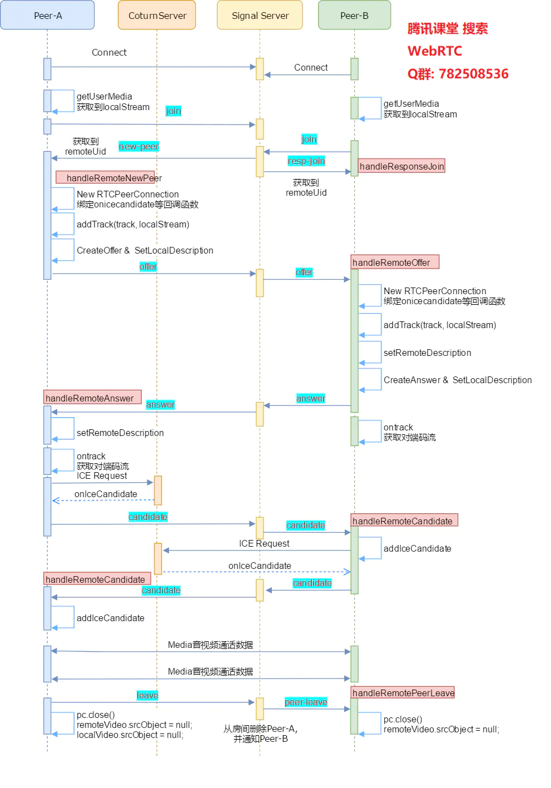

<!--
 * @Author: mcdowell
 * @Date: 2020-06-01 16:12:52
 * @LastEditors: mcdowell
 * @LastEditTime: 2020-06-22 10:56:23
-->

# 连接建立



> WebRTC 之间建立连接的过程是非常复杂的。之所以复杂，主要的原因在于它**既要考虑==传输的高效性==，又要保证端与端之间的==连通率==**。

当同时**存在多个有效连接时，它首先选择传输质量最好的线路**，**如能用内网连通就不用公网**。另外，如果**尝试了很多线路都连通不了，那么它还会使用服务端中继的方式让双方连通**，总之，是“想尽办法，用尽手段”让双方连通

## 连接建立的基本原则

> 在上节中提到，在进行媒体协商后 （offer、Answer 等一系列 操作后），WebRTC 底层会收集，Candidate，并进行连通性检测后建立通道。
> 也就是本节要说的过程 【收集 Candidate、连通性检测后建立通道】

### Candidate

在了解 WebRTC 建立连接的过程之前，必须了解基本概念：**ICE Candidate （ICE 候选者）**。

打洞技术依靠 要建立的每个对等端来收集 一组可通过 internet 访问他们的潜在访问方式。这些 ip 端口组 称为 ‘地址候选项’，简称‘候选项’。借助 stun 服务，浏览器得到 NAT 类型及 NAT 后的地址（公网 IP 地址）;借助 trun 服务 ，浏览器得到 中继转发所需的地址及端口（中继候选者）。这些都会存到 RTCIceCandidate 对象的 candidate 属性中。

> 保存 WebRTC 与 远端通信时使用的**协议**、**IP 地址**和**端口** 的集合

它表示 WebRTC 与 远端通信时使用的协议、IP 地址和端口，一般由以下字段组成：

```js
{
	IP: xxx.xxx.xxx.xxx, // 本地 IP 地址
	port: number, // 本地端口号
	type: host/srflx/relay, // 候选者类型，包括 host、srflx 和 relay
	priority: number, // 优先级
	protocol: UDP/TCP, // 传输协议
	usernameFragment: string // 访问服务的用户名
	...
}
```

> - host 表示本机候选者 （内网连通）
> - srflx 表示内网主机映射的外网的地址和端口 （P2P 方式）
> - relay 表示中继候选者

#### 作用过程

- **当 WebRTC 通信双方彼此要进行连接时，每一端都会提供许多候选者**，比如你的主机有两块网卡，那么每块网卡的不同端口都是一个候选者。
- **WebRTC** 会按照上面描述的格式**对候选者进行排序**，然后**按优先级从高到低的顺序进行连通性测试**，当连通性测试成功后，通信的双方就建立起了连接。
  - 先级从高到低：**host(本机内网连通)>srflx(内网主机映射的外网的地址和端口)>relay(中继候选者)**
  - **先对 host 类型的候选者进行连通性检测**(检测内网连通性)，如果它们之间可以互通，则直接建立连接。
  - 同样的道理，如果 host 类型候选者之间无法建立连接，那么 会尝试次优先级的 srflx 类型的候选者。也就是尝试让通信双方直接通过 P2P 进行连接，如果连接成功就使用 P2P 传输数据；
  - 如果失败，就最后尝试使用 relay 方式建立连接。

#### 关于 ICE

> 用于实现打洞的协议 称为 交互式连接建立协议 （Interactive Connectivity Establishment）

ICE (Interactive Connectivity Establishment ： 交互式连接建立)是一个被 WebRTC 使用的框架。一种综合性的 NAT 穿越技术，可以整合各种 NAT 穿越技术如 STUN、TURN（Traversal Using Relay NAT 中继 NAT 实现的穿透）。ICE 会先使用 STUN，尝试建立一个基于 UDP 的连接，如果失败了，就会去 TCP（先尝试 HTTP，然后尝试 HTTPS），如果依旧失败 ICE 就会使用一个中继的 TURN 服务器。

这个框架的算法是寻找最低等待时间的路径去连接两端，通常采用以下顺序寻找：

- 直接的 UDP 连接 (在且仅在这种情况下，一个 STUN 的服务器会被用来查找主机端面向网络的地址)。
- 直接的 TCP 连接, 通过 HTTP 端口
- 直接的 TCP 连接, 通过 HTTPS 端口
- 间接的连接通过中继器／TURN 服务器 (如果一个直接连接失败了, 比如当一个主机端位于防火墙之后阻止了 NAT 穿越)

##### ICE 状态

##### ICE 保活

- 对于每个 ICE 通道，都需要为其会话进行保活。
- 采用 STUN binding request 或者 STUN binding indication。
- 如果没有收到响应，则会重传，直到最大重传次数。

### 收集 Candidate

端对端的建立更主要的工作是 Candidate 的收集。

WebRTC 将 Candidate 分为三种类型：

- host 类型，即本机内网的 IP 和端口；（ 比较容易获得 ）
- srflx 类型, 即本机 NAT 映射后的外网的 IP 和端口；
- relay 类型，即中继服务器的 IP 和端口。

其中，host 类型优先级最高，srflx 次之，relay 最低（前面我们已经说明过了）。

#### srflx 类型: STUN 服务

> srflx 类型的 Candidate 实际上就是**内网地址和端口经 NAT 映射后的外网地址和端口**。

**如果主机没有公网地址，是无论如何都无法访问公网上的资源的。**
一般情况下，**主机都只有内网 IP 和端口**，但是在**内网的网关上都有 NAT (Net Address Transport) 功能**，==NAT 的作用就是进行内外网的地址转换==。当你要访问公网上的资源时，**NAT 首先会将该主机的内网地址转换成外网地址，然后才会将请求发送给要访问的服务器**；**服务器处理好后将结果返回给主机的公网地址和端口，再通过 NAT 最终中转给内网的主机**

> 引申：获得外网 IP 地址
> 根据上面描述，其实 只需要在公网上架设一台服务器，并向这台服务器发个请求说，服务器回值。这样你就可以知道自己的公网 IP 了（在百度搜索 ip 获得外网 ip 地址 就是这个原理）

上面的描述已经被定义成了一套规范，即 RFC5389 ，也就是 **STUN 协议**(Session Traversal Utilities for NAT，NAT 会话穿越应用程序)，我们只要遵守这个协议就可以拿到自己的公网 IP 了,而后 **创建 UDP 通信**。

这里我们举个例子，看看通过 STUN 协议，主机是如何获取到自己的外网 IP 地址和端口的。

- 首先在**外网搭建一个 STUN 服务器**，现在比较流行的 STUN 服务器是 CoTURN，你可以到 GitHub 上自己下载源码编译安装。
- 当 STUN 服务器安装好后，从**内网主机发送一个 binding request 的 STUN 消息到 STUN 服务器**。
- STUN 服务器收到该请求后，会**将请求的 IP 地址和端口填充到 binding response 消息中，然后顺原路将该消息返回给内网主机**。此时，收到 binding response 消息的内网主机就可以解析 binding response 消息了，并可以从中**得到自己的外网 IP 和端口**

#### relay 类型:TURN 服务

> relay 服务是通过 TURN 协议实现的。所以我们经常说的 relay 服务器或 TURN 服务器它们是同一个意思，都是指中继服务器

- relay 类型 候选者的**优先级最低**，**通率最高**。
- 在其他候选者都无法连通的情况下，relay 候选者就成了最好的选择【最佳备胎】。
- relay 型候选者的**获取也是通过 STUN 协议完成的**，只不过它使用的 **STUN 消息类型与获取 srflx 型候选者的 STUN 消息的类型不一样**而已。

> RFC5766 的 TURN 协议描述了如何获取 relay 服务器（即 TURN 服务器）的 Candidate 过程。其中最主要的是 Allocation 指令。通过向 TURN 服务器发送 Allocation 指令，relay 服务就会在服务器端分配一个新的 relay 端口，用于中转 UDP 数据报。

### 按优先级顺序进行连通性检测

#### NAT 打洞 /P2P 穿越

当收集到 Candidate 后，WebRTC 就开始按优先级顺序进行连通性检测了。

1. 它首先会判断两台主机是否处于同一个局域网内，如果双方确实是在同一局域网内，那么就直接在它们之间建立一条连接。
2. 但如果两台主机**不在同一个内网**，**WebRTC 将尝试 NAT 打洞（P2P 穿越）**。
   - NAT 打洞是极其复杂的过程
     - 首先需要对 NAT 类型做判断，
     - 检测出其类型后，才能判断出是否可以打洞成功，
     - 只有存在打洞成功的可能性时才会真正尝试打洞。

##### WebRTC 将 NAT 分类为 4 种类型，分别是

- 完全锥型 NAT
- IP 限制型 NAT
- 端口限制型 NAT
- 对称型 NAT

  > **对称型 NAT 与 对称型 NAT** 是无法进行 P2P 穿越的；
  > **对称型 NAT 与 端口限制型 NAT** 也是无法进行 P2P 连接的

## 流程总结

> 交互通信 ：呼叫要交换两种信息，一是候选地址（交换候选者），二是媒体信息（交换 SDP 媒体协商）。

[信令与视频通话](https://developer.mozilla.org/zh-CN/docs/Web/API/WebRTC_API/Signaling_and_video_calling)
[](https://blog.csdn.net/ice_ly000/article/details/103162838)

### webrtc 时序图

[](https://zhuanlan.zhihu.com/p/25087606)

[呼叫建立过程](https://blog.csdn.net/ice_ly000/article/details/103204327)

### 场景预制说明

- 通信的双方我们称为 client_A 和 client_B；
- client_A 为呼叫方，client_B 为被呼叫方；
- TURN_C 为中继服务器，也称为 relay 服务器或 TURN 服务器。

1. client_A 创建 RTCPeerConnection 后（操作 本地 媒体轨道 addTracks），使用 createOffer 创建 Offer，得到 SDP。
2. client_A 使用 setLocalDescription，设置本地 SDP 信息 （媒体信息描述）,`client_A 开始 收集 ICE 候选者,[ 本地地址 host类型（从网卡获得）、反射地址 srvflx类型（连接stun 服务获 取）、中继地址 relay 类型（从trun 服务或其他媒体中继服务获得）]`
3. client_A 随后 通过 信令服务 将 SDP 发送 给 client_B
4. client_B 通过 信令服务 ，接收到 client_A 的 SDP ，创建 RTCPeerConnection 后（操作 本地 媒体轨道 addTracks），通过 setRemoteDescription，设置远端的 SDP （连接另一端的描述）
5. client_B 通过 createAnswer，创建 Answer ，`lient_B 开始 收集 ICE 候选者（方式与 步骤2 相同）`，随后 通过 信令服务 将 SDP 发送 给 client_A
6. client_A 接收到 client_B 的 SDP 通过 setRemoteDescription，设置远端的 SDP 到 本地远端域 ,到此媒体协商完毕，确定了编解码协议

7. 步骤 2 client_A 创建 Offer（实际 是 setLocalDescription 后） 就已经 收集 ICE 候选者，收到后（回来一个发一个） 立即触发 onIceCandidate 事件，从 ICE 层接受外向候选 通过 信令服务 发给 client_B(开始进行 ICECandidate 交换【ICE 协商】 )
8. client_B 接收 信令服务 Candidate 事件，先使用 addIceCandidate 保存 client_A 的 ICECandidate 到候选者列表，随即开始尝试 **联通性测试**（按优先级顺序进行连通性检测）
9. 步骤 5 client_B 创建 Answer （实际 是 setLocalDescription 后）就已经 收集 ICE 候选者，收到后（回来一个发一个）立即触发 onIceCandidate 事件，通过 信令服务 发给 client_A 【此步骤 与 7、8 并无前后关系，异步的】
10. client_A 通过 信令服务 接到 client_B 候选者信息，先使用 addIceCandidate 保存 client_B 的 ICECandidate 到候选者列表，随即开始尝试 **联通性测试**（按优先级顺序进行连通性检测 client_B）
11. 联通性测试 按照 候选地址 Type 顺序 host > srvflx > prflx > relay
12. host 类型 本地局域网直接进行联通，srvflx 类型 发 Stun Binding 请求，进行 Stun 检查。经过一些了测试连接后 选定最优候选地址，并启动媒体
13. 长连接：为确保 NAT 映射和过滤规则不在媒体会话期间超时，**ICE 会不断通过使用中的候选项对发送 Stun 连接检查**。

> 除了主叫必须创建 Offer 才开始收集候选地址、被叫必须创建 Answer 才开始收集候选地址外，ICE 代理 是相互独立地处理媒体 和 候选地址

##### prflx 候选项

假如 client_A 和 Stun 服务器之间连接状态不好，在它收到 client_B 发来的 srflx 候选者 之后还没得出自个的 srflx 候选者，随即开始进行联通测试（得到对方的 srflx 候选者，就可以 Stun 检查，进行打洞联通）。client_B 收到这个请求，从请求解析出 client_A 的地址信息。虽然这个地址在值上等于 client_A 的 srflx，但不是从信令服务器得到，而是来自对端的 Stun 请求。此时 client_B 就会以这个 prflx 向状态表新建 Connection。

client_A 在之后终于向 Stun 服务器拿到了自个的 srflx，并通过信令服务器发向 client_B。client_B 发现这个 srflx 值对应的 Connection 已存在，就不会再创建了。

##### 一般在调用 setLocalDescription 方法后才开始进行 ICE 过程，开启候选者收集 因为

> setLocalDescription 得到得本地 SDP 信息中指示了需要的 ICE 组件个数（跟需要建立的传输通道数相同，而传输通道数与媒体轨道个数、媒体轨道的绑定策略 BundlePolicy、RTP/RTCP 的通道复用策略 RtcpMuxPolicy 都有关系）以及哪些候选项（与 IceTransportsType 参数有关）需要被收集。然而，为了加速媒体通道建立，一些应用如果提前知道需要的 ICE 组件个数，那么它可以提前（在调用 setLocalDescription 之前就开始）收集一个池子的 ICE 候选项来帮助快速的建立媒体通道。

1.  场景 1: client_A、client_B 属于同一办公区域同一网段。一般存在两种联通路径：

- 一种是双方通过内网直接进行连接；
- 另一种是通过公网，也就是通过公司的网关，从公网绕一圈后再进入公司实现双方的通信
